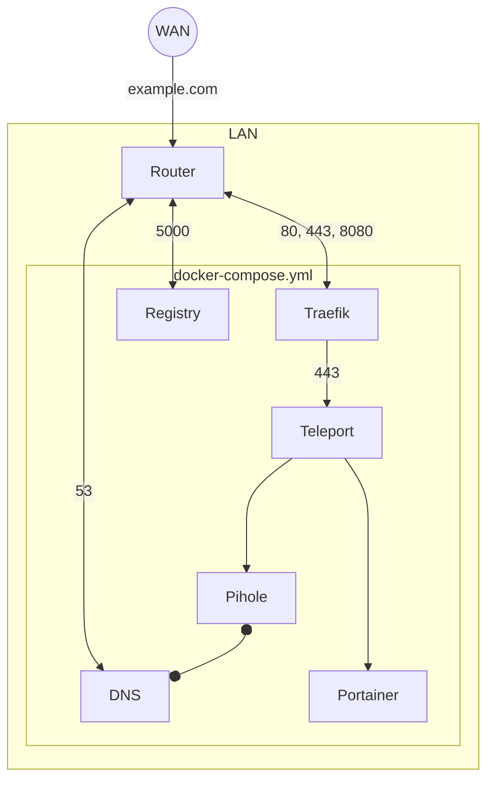

---

# OpenStudioLandscapesHub

## Up

```shell
/usr/bin/docker \
    compose \
    --progress plain \
    --file docker-compose.yml \
    --project-name openstudiolandscapes-hub \
    up \
    --remove-orphans \
    --detach
```

