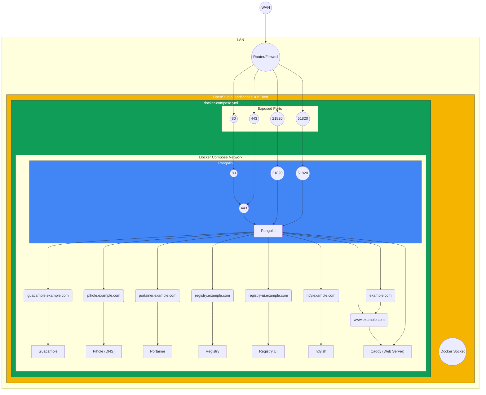

[](https://github.com/michimussato/OpenStudioLandscapes)

---

<!-- TOC -->
* [OpenStudioLandscapesHub Template](#openstudiolandscapeshub-template)
  * [Topology Concept](#topology-concept)
  * [Components](#components)
  * [Requirements](#requirements)
  * [Docker Compose](#docker-compose)
    * [Up](#up)
    * [Down](#down)
    * [Logs](#logs)
  * [DNS](#dns)
    * [Zone File Example for example.com](#zone-file-example-for-examplecom)
  * [Hashing Passwords](#hashing-passwords)
    * [`htpasswd`](#htpasswd)
    * [Python](#python)
    * [Docker](#docker)
* [Todo](#todo)
<!-- TOC -->

---

# OpenStudioLandscapesHub Template

> [!WARNING]
> 
> This is a work in progress concept. The provided setup
> is functional but might need some manual configuration and tweaking.
> This guide will improve over time. Once it's considered finished,
> this warning will be removed.

This is a basic Docker Compose setup to provide distributed teams (remote workers)
access to your resources created with [OpenStudioLandscapes](https://github.com/michimussato/OpenStudioLandscapes).

> [!NOTE]
> 
> As long as you're running
> [OpenStudioLandscapes](https://github.com/michimussato/OpenStudioLandscapes) 
> on a single, isolated machine, embedding Landscapes into a 
> network infrastructure is not generally needed. 

As soon as multiple machines are involved (for example workers in a render farm or 
remote collaborators accessing your locally hosted OpenStudioLandscapes 
resources), things can get complicated pretty quickly in case you
don't have such a system set up already - like a local DNS server
for instance.

OpenStudioLandscapesHub provides a basic selection of services that
enable a scalable OpenStudioLandscapes environment. A core system
of this Hub is [Pangolin](https://docs.pangolin.net/). It's open source and free (when hosted
locally).

Services provided:
- [Pangolin](./docker-compose/hub/pangolin/README.md)
- [Pi-Hole (DNS)](./docker-compose/hub/pihole/README.md)
- [Docker Registry](./docker-compose/hub/registry/README.md)
  - [With Registry UI](https://hub.docker.com/r/joxit/docker-registry-ui)
- [Portainer](./docker-compose/hub/portainer/README.md)
- [Apache Guacamole (Multi-Arch)](./docker-compose/hub/guacamole/README.md)
- [ntfy.sh](./docker-compose/hub/ntfy/README.md)
- [Caddy](./docker-compose/hub/caddy/README.md)

Consider:
- [Infisical](https://infisical.com/)
- [Arcane](https://getarcane.app/)
  - [The Best Docker Manager I’ve Seen! // Arcane Tutorial](https://www.youtube.com/watch?v=YwpWqdexEIk)
  - [Docs](https://getarcane.app/docs)

## Topology Concept



## Components

- [Caddy]()
- [filebrowser]()
- [Guacamole]()
- [ntfy.sh]()
- [Pangolin]()
- [Pihole]()
- [Portainer]()
- [Registry]()

## Requirements

- `docker` ([Setup Guide](https://docs.docker.com/engine/install/))
- [Domain](#dns)

## Docker Compose

### Up

```shell
docker compose \
    --file docker-compose/hub/docker-compose.hub.yml \
    --project-name openstudiolandscapes-hub \
    up \
    --remove-orphans \
    --detach
```

### Down

```shell
docker compose \
    --file docker-compose/hub/docker-compose.hub.yml \
    --project-name openstudiolandscapes-hub \
    down
```

### Logs

```shell
docker compose \
    --file docker-compose/hub/docker-compose.hub.yml \
    --project-name openstudiolandscapes-hub \
    logs \
    --follow
```

## DNS

> [!IMPORTANT]
> 
> DNS-01 Challenge needs API access.

### Zone File Example for example.com

```
$ORIGIN mydomain.com.
@	3600	IN	SOA	[...]
@	3600	IN	NS	[ns1].
@	3600	IN	NS	[ns2].
@	3600	IN	A	<MY_PUBLIC_IP>
*	3600	IN	CNAME	example.com.
```

## Hashing Passwords

> [!TIP]
> 
> This could be used to predefine passwords
> for services like [Portainer](docker-compose/hub/.env/template.portainer.env) 
> or [filebrowser](docker-compose/hub/.env/template.filebrowser.env).
> 
> Be aware that `$` characters have to be escaped with another `$`
> character, like so: `$$`.

References:
- [How to Compute bcrypt Hash in Shell](https://www.baeldung.com/linux/bcrypt-hash)

### `htpasswd`

Three different ways to get a hash
of `my_secret_password`.

```shell
htpasswd -bnBC 10 "" my_secret_password | cut -d : -f 2
```

### Python

> [!TIP]
> 
> For reference, an OpenStudioLandscapes implementation is available here:
> [filebrowser/config/models.py](https://github.com/michimussato/OpenStudioLandscapes-filebrowser/blob/main/src/OpenStudioLandscapes/filebrowser/config/models.py)

```shell
python3 -c "import bcrypt; print(bcrypt.hashpw(b'my_secret_password', bcrypt.gensalt()))"
```

### Docker

```shell
docker run --entrypoint htpasswd httpd:2 -bnBC 10 "" my_secret_password | cut -d : -f 2
```

---

# Todo

- [ ] Update `docker-compose/hub/.volumes/config/pangolin`