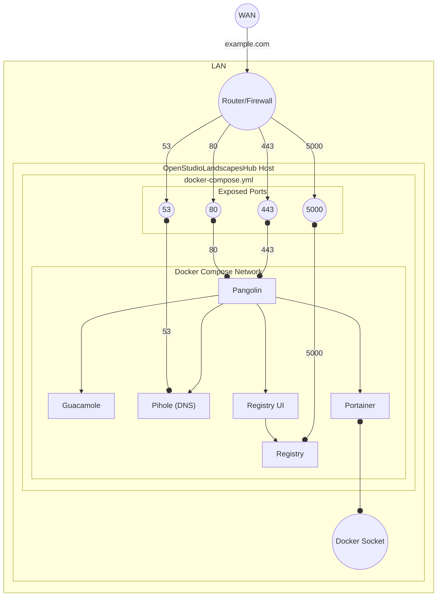

[](https://github.com/michimussato/OpenStudioLandscapes)

---

<!-- TOC -->
* [OpenStudioLandscapesHub](#openstudiolandscapeshub)
  * [Requirements](#requirements)
  * [Up](#up)
  * [Topology](#topology)
  * [DNS](#dns)
    * [Zone File](#zone-file)
<!-- TOC -->

---

# OpenStudioLandscapesHub

> [!WARNING]
> 
> This is a work in progress concept. The provided setup
> is functional but might need some manual configuration and tweaking.
> Once this 

This is a basic Docker Compose setup to provide distributed teams (remote workers)
access to your resources created with [OpenStudioLandscapes](https://github.com/michimussato/OpenStudioLandscapes).

> [!NOTE]
> 
> As long as you're running
> [OpenStudioLandscapes](https://github.com/michimussato/OpenStudioLandscapes) 
> on a single, isolated machine, embedding Landscapes into a 
> network infrastructure is not generally needed. 

As soon as multiple machines are involved (for example workers in a render farm or 
remote collaborators accessing your locally hosted OpenStudioLandscapes 
resources), things can get complicated pretty quickly in case you
don't have such a system set up already - like a local DNS server
for instance.

OpenStudioLandscapesHub provides a basic selection of services that
enable a scalable OpenStudioLandscapes environment.

Services provided:
- [Pangolin](pangolin/README.md)
- [Pi-Hole (DNS)](pihole/README.md)
- [Docker Registry](registry/README.md)
  - [With Registry UI](https://hub.docker.com/r/joxit/docker-registry-ui)
- [Portainer](portainer/README.md)
- [Apache Guacamole (Multi-Arch)](guacamole/README.md)

## Requirements

- `docker` ([Setup Guide](https://docs.docker.com/engine/install/))
- [Domain](#dns)

## Up

```shell
docker compose \
    --file docker-compose.yml \
    --project-name openstudiolandscapes-hub \
    up \
    --remove-orphans \
    --detach
```

## Topology Concept



## DNS

DNS-01 Challenge needs API access.

### Zone File Example for mydomain.com

```
$ORIGIN mydomain.com.
@	3600	IN	SOA	[...]
@	3600	IN	NS	[ns1].
@	3600	IN	NS	[ns2].
@	3600	IN	A	<MY_PUBLIC_IP>
pangolin	3600	IN	CNAME	mydomain.com.
*.pangolin	3600	IN	CNAME	pangolin.mydomain.com.
```
